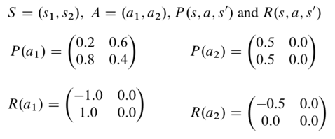

## Decision Making under uncertainty: Markov Decision Process

Decision making and planning are core problems in the field of Artificial Intelligence. Decision making describes the cognitive process of taking the best action in a given environment. If a sequence of actions is executed, this is called sequential decision making. 
It is important to consider uncertainty in decision making. Real environments behave stochastically and are only partially observable. For example, during a measurement, the measured values may be noisy, resulting in an uncertain measured value about which no 100% reliable statements can be made. On the other hand, processes can also have a non-deterministic outcome, whereby the desired result is not achieved with a certain probability when an action is performed. In order to represent these uncertainties, the concept of the Markov Decision Processes (MDPs) was introduced.

### Mathematical description
Definition: A markov decision process is defined as a tupel

with: 
 - S a finite set of states
 - A a finite set of actions
 - P: S x A x S -> R, transition probabilities
 - R: S x A x S -> R, rewards
 - discount factor [0,1]
 
Please notice:

### Example:
Definition:

Graphical: 

### Expected Reward
### Policy
### Evaluation of a policy: Bellman Equation
### Find the optimal policy: Value iteration

## Tutorial for using the MDP framework

