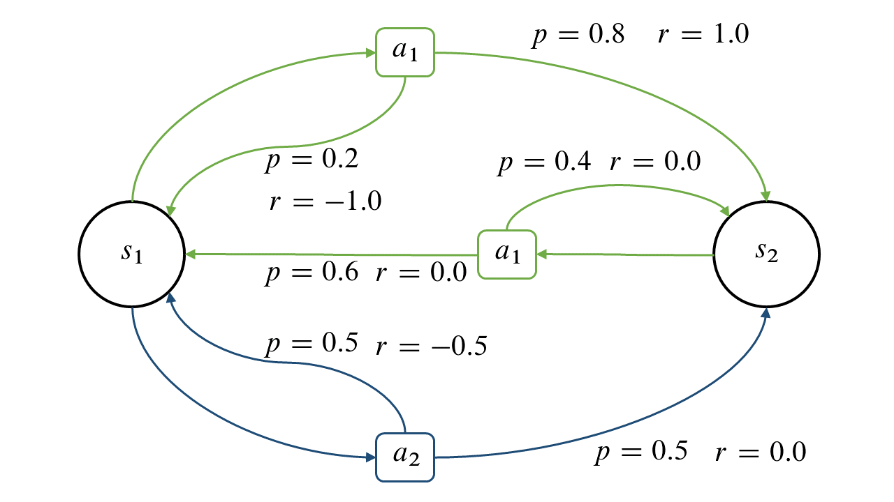

## Decision Making under uncertainty: Markov Decision Process

Decision making and planning are core problems in the field of Artificial Intelligence. Decision making describes the cognitive process of taking the best action in a given environment. If a sequence of actions is executed, this is called sequential decision making. 
It is important to consider uncertainty in decision making. Real environments behave stochastically and are only partially observable. For example, during a measurement, the measured values may be noisy, resulting in an uncertain measured value about which no 100% reliable statements can be made. On the other hand, processes can also have a non-deterministic outcome, whereby the desired result is not achieved with a certain probability when an action is performed. In order to represent these uncertainties, the concept of the Markov Decision Processes (MDPs) was introduced.

### Mathematical description
Definition: A markov decision process is defined as a tupel

with: 
 - S a finite set of states
 - A a finite set of actions
 - P: S x A x S -> R, transition probabilities
 - R: S x A x S -> R, rewards
 - discount factor [0,1]
 
Please notice:

### Example:
Definition:

Graphical: 

### Policy
A policy is a mapping from states to actions. A policy thus specifies which action a is to be executed when one 
is in a state s.
### Evaluation of a policy: Bellman Equation
The value function V assigns to each states the value V(s) = E(Gt|st=s), where st is the state at time step t.
Writing V and R as vectors the above equation becomes 

and hence

This is called the Bellman equation
### Find the optimal policy: Value iteration
Given a MDP, we want to find the policy such that the corresponding value function is maximal and hence, 
the expected reward. 
To achieve that goal, an algorithm called value iteration is used.
You can find it in the source below.

Thanks to: https://ipvs.informatik.uni-stuttgart.de/mlr/wp-content/uploads/2016/04/02-MarkovDecisionProcess.pdf
## Tutorial for using the MDP framework
To build a Markov Chain, the an MDP instance needs to be initialized in the following way:
- states: list of states, e.g. states = ('s1', 's2', ...)
- actions: list of actions, e.g. actions = ('a1', 'a2', ...)
- probabilities: dictionary containing the transition probabilities,
                            structure: P(s,a,s') with s = recent state, a = action to take and s' = successor state
                            e.g. probabilities = {('s', 'a', 's'') : p, ...}
- rewards: dictionary containing the reward when beeing in state s, taking action a, and going to state s'
                            structure: R(s,a,s') with s = recent state, a = action to take and s' = successor state
                            e.g. rewards = {('s', 'a', 's'') : r, ...}
                            
**The main part of the class is the value iteration algorithm that is used to calculate the best policy for a given MDP**                        